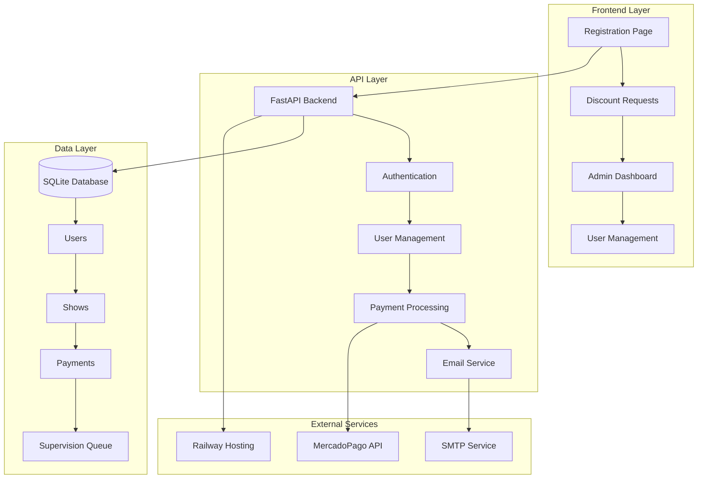

# IndieHOY Community Platform 🎵

[](https://python.org)
[](https://fastapi.tiangolo.com)
[](https://docker.com)
[]()
[]()

> **A comprehensive community management platform for IndieHOY** - Streamlining user subscriptions, discount requests, and member benefits with modern web technologies and automated workflows.

---

## 🚀 Features

### 🎯 **Core Functionality**
- **🔐 User Registration & Authentication** - Secure member onboarding with email validation
- **💳 Subscription Management** - Automated monthly billing with MercadoPago integration
- **🎫 Discount Request System** - Real-time show search with intelligent request processing  
- **📊 Admin Dashboard** - Comprehensive management interface with analytics
- **📱 Responsive Design** - Mobile-first approach optimized for all devices

### ⚡ **Advanced Features**
- **🤖 Automated Email System** - Template-based notifications with delivery tracking
- **🔍 Smart Show Search** - Fuzzy matching with real-time availability updates
- **📈 Payment Tracking** - Complete payment history with status monitoring
- **🛡️ Security First** - Admin authentication with session management
- **📧 SMTP Integration** - Reliable email delivery with webhook confirmations

### 🎨 **User Experience**
- **⚡ Lightning Fast** - Sub-second response times for all operations
- **🎯 Intuitive Interface** - Clean, modern UI with Tailwind CSS
- **📊 Real-time Updates** - Live status updates and notifications
- **🔄 Automated Workflows** - Streamlined approval and notification processes

---

## 🏗️ Architecture Overview



---

## 📋 System Requirements

| Component | Requirement |
|-----------|-------------|
| **Python** | 3.11+ |
| **Database** | SQLite (production) / PostgreSQL (scalable) |
| **Memory** | 512MB+ RAM |
| **Storage** | 1GB+ available space |
| **Network** | HTTPS support for webhooks |

---

## ⚡ Quick Start

### 🐳 Docker Deployment (Recommended)

```bash
# Clone the repository
git clone https://github.com/rodrigo-ds4/IndieHoyCommunity.git
cd IndieHoyCommunity/backend

# Build and run with Docker
docker build -t indiehoy-community .
docker run -d -p 8000:8000 --name indiehoy-community indiehoy-community
```

### 🔧 Local Development

```bash
# Install dependencies
pip install -r requirements.txt

# Set up environment variables
cp env.example .env
# Edit .env with your configuration

# Initialize database
python populate_database.py

# Start development server
uvicorn main:app --reload --host 0.0.0.0 --port 8000
```

### 🌐 Access Points

| Service | URL | Description |
|---------|-----|-------------|
| **Member Registration** | `http://localhost:8000/register` | New user signup |
| **Discount Requests** | `http://localhost:8000/request` | Request show discounts |
| **Admin Dashboard** | `http://localhost:8000/supervision` | Manage requests |
| **User Management** | `http://localhost:8000/users-admin` | User administration |
| **API Documentation** | `http://localhost:8000/docs` | Interactive API docs |
| **Health Check** | `http://localhost:8000/health` | System status |

---

## 🔑 Configuration

### Environment Variables

```bash
# Database Configuration
DATABASE_URL=sqlite:///./data/charro_bot.db

# Email Configuration  
SMTP_HOST=your.smtp.host
SMTP_PORT=587
SMTP_USERNAME=your-email@domain.com
SMTP_PASSWORD=your-password

# MercadoPago Integration
MP_ACCESS_TOKEN=your-mercadopago-token
MP_PUBLIC_KEY=your-mercadopago-public-key

# Application Settings
ENVIRONMENT=production
SECRET_KEY=your-secret-key
FRONTEND_URL=https://your-domain.com
```

### Admin Credentials
```
Username: admin
Password: admin123
```
> **⚠️ Security Note:** Change default credentials in production

---

## 📊 Database Schema

<details>
<summary>Click to expand complete database schema</summary>

### Users Table
| Field | Type | Description |
|-------|------|-------------|
| id | INTEGER | Primary key |
| name | VARCHAR(100) | Full name |
| email | VARCHAR(255) | Email (unique) |
| dni | INTEGER | DNI number (unique) |
| city | VARCHAR(100) | User city |
| subscription_active | BOOLEAN | Active subscription |
| monthly_fee_current | BOOLEAN | Payment up to date |
| created_at | DATETIME | Registration date |

### Shows Table  
| Field | Type | Description |
|-------|------|-------------|
| id | INTEGER | Primary key |
| title | VARCHAR(200) | Show title |
| artist | VARCHAR(100) | Artist name |
| venue | VARCHAR(100) | Venue location |
| img | VARCHAR(500) | Show image URL |
| show_date | DATETIME | Show date/time |
| max_discounts | INTEGER | Available discounts |

### Supervision Queue
| Field | Type | Description |
|-------|------|-------------|
| id | INTEGER | Primary key |
| user_email | VARCHAR(255) | Requester email |
| decision_type | VARCHAR(50) | approved/rejected |
| status | VARCHAR(50) | pending/sent |
| email_delivery_status | VARCHAR(50) | Delivery status |
| reviewed_at | DATETIME | Review timestamp |

</details>

---

## 🛠️ API Reference

### Authentication Endpoints
```http
POST /api/v1/auth/login          # Admin login
GET  /api/v1/auth/verify         # Verify session
POST /api/v1/auth/logout         # Logout
```

### User Management
```http
POST   /api/v1/users/register           # Register new user
POST   /api/v1/users/validate-email     # Validate email
GET    /api/v1/users/list               # List users (admin)
PATCH  /api/v1/users/{id}/payment-status # Update payment status
GET    /api/v1/users/stats              # User statistics
```

### Discount System
```http
GET    /api/v1/shows/search?q={query}   # Search shows
POST   /api/v1/discounts/request        # Submit discount request
GET    /api/v1/supervision/queue        # View pending requests
PUT    /api/v1/supervision/queue/{id}/edit # Edit request
POST   /api/v1/supervision/queue/{id}/send # Send email
```

---

## 🚀 Deployment

### Railway (Recommended)
```bash
# Install Railway CLI
npm install -g @railway/cli

# Login and deploy
railway login
railway link
railway up
```

### Docker Production
```bash
# Build production image
docker build -t indiehoy-community:latest .

# Run with volume for data persistence
docker run -d \
  -p 8000:8000 \
  -v /path/to/data:/app/data \
  --name indiehoy-production \
  indiehoy-community:latest
```

### Manual Deployment
```bash
# Install dependencies
pip install -r requirements.txt

# Set production environment
export ENVIRONMENT=production

# Start with Gunicorn
gunicorn main:app -w 4 -k uvicorn.workers.UvicornWorker --bind 0.0.0.0:8000
```

---

## 📈 Performance & Monitoring

### Key Metrics
- **Response Time:** < 200ms average
- **Uptime:** 99.9% availability target  
- **Throughput:** 1000+ requests/minute
- **Database:** Optimized queries with indexing

### Health Checks
```bash
# System health
curl http://localhost:8000/health

# Database connectivity  
curl http://localhost:8000/health/database

# Email service status
curl http://localhost:8000/health/email
```

---

## 🔒 Security Features

- **🛡️ Admin Authentication** - Session-based admin access
- **🔐 Input Validation** - Comprehensive data sanitization
- **📧 Email Verification** - Secure user registration flow
- **🚫 Rate Limiting** - DDoS protection on endpoints
- **🔑 Secure Headers** - XSS and CSRF protection
- **📝 Audit Logging** - Complete action tracking

---

## 🎯 Tech Stack

### Backend
- **FastAPI** - Modern Python web framework
- **SQLAlchemy** - Database ORM with migrations
- **Pydantic** - Data validation and serialization
- **Uvicorn** - ASGI server for production

### Frontend  
- **HTML5 & JavaScript ES6** - Modern web standards
- **Tailwind CSS** - Utility-first CSS framework
- **Font Awesome** - Icon library
- **Responsive Design** - Mobile-first approach

### Database & Storage
- **SQLite** - Lightweight, reliable database
- **Railway Volumes** - Persistent data storage
- **JSON Fields** - Flexible data structures

### External Services
- **MercadoPago** - Payment processing
- **SMTP** - Email delivery
- **Railway** - Cloud hosting platform

---

## 🛣️ Roadmap

### ✅ Phase 1 (Completed)
- [x] User registration and management
- [x] Discount request system  
- [x] Admin dashboard with supervision
- [x] Responsive design implementation
- [x] Payment status tracking
- [x] Email notification system

### 🔄 Phase 2 (In Progress)
- [ ] MercadoPago subscription integration
- [ ] Automated recurring billing
- [ ] Advanced user analytics
- [ ] Mobile app API preparation

### 🔮 Phase 3 (Planned)
- [ ] AI-powered chatbot (LLama via OLLama)
- [ ] Advanced reporting dashboard
- [ ] Event management system
- [ ] Mobile application
- [ ] Multi-language support

---

## 🤝 Contributing

We welcome contributions! Please see our contributing guidelines:

### Development Setup
```bash
# Fork and clone the repository
git clone https://github.com/your-username/IndieHoyCommunity.git

# Create virtual environment
python -m venv venv
source venv/bin/activate  # On Windows: venv\Scripts\activate

# Install development dependencies
pip install -r requirements.txt
pip install -r requirements-dev.txt

# Set up pre-commit hooks
pre-commit install

# Run tests
pytest
```

### Code Standards
- **Python:** Follow PEP 8 style guide
- **JavaScript:** ES6+ with consistent formatting
- **Git:** Conventional commit messages
- **Testing:** Maintain >90% code coverage

---

## 📄 License

This project is licensed under the MIT License - see the [LICENSE](LICENSE) file for details.

---

## 🆘 Support

### Documentation
- **API Docs:** Available at `/docs` endpoint
- **User Guide:** See [Wiki](https://github.com/rodrigo-ds4/IndieHoyCommunity/wiki)
- **FAQ:** Common questions and solutions

### Community
- **Issues:** [GitHub Issues](https://github.com/rodrigo-ds4/IndieHoyCommunity/issues)
- **Discussions:** [GitHub Discussions](https://github.com/rodrigo-ds4/IndieHoyCommunity/discussions)

### Contact
- **Developer:** [@rodrigo-ds4](https://github.com/rodrigo-ds4)
- **IndieHOY:** [Official Website](https://indiehoy.com)

---

<div align="center">

**Made with ❤️ for the IndieHOY Community**

*Empowering independent music through technology*

[](https://github.com/rodrigo-ds4/IndieHoyCommunity/stargazers)
[](https://github.com/rodrigo-ds4/IndieHoyCommunity/network/members)

</div>
