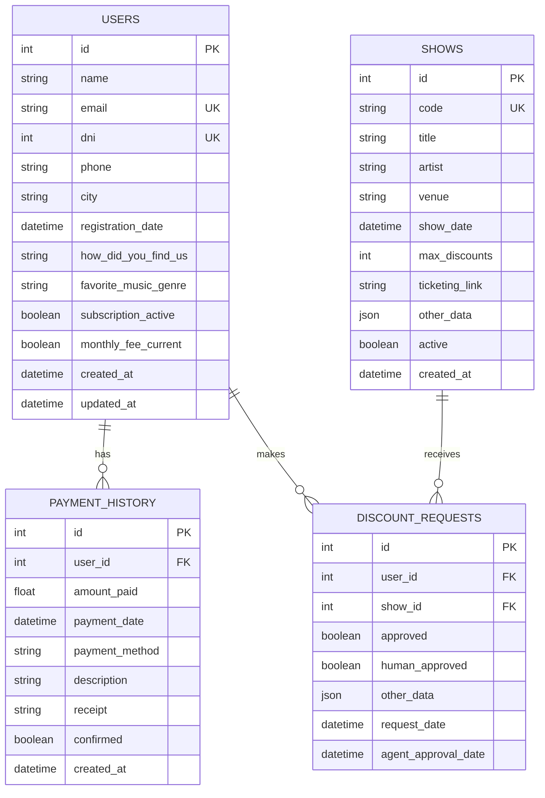

# Project: Chatbot + Decision Agent with LLM (llama3)

## Objective
Develop a system that allows users to request show discounts through:
- **Conversational chatbot** (Charro Bot)
- **Web form**

The system will validate requests using **llama3 via Ollama** and make autonomous decisions about discounts with human supervision.

## Microservices Architecture

### Docker Containers
1. **Ollama LLM** - llama3 model (WORKING)
2. **Backend API** - FastAPI + LangChain + RAG (RUNNING)
3. **Database** - SQLite (IMPLEMENTED)

### Communication Flow
- Web form → Backend API
- Chatbot → Backend API → Ollama LLM
- Backend → Database (users, shows, discounts)
- LLM Agent → Human Supervision → Email Dispatch

## Database Schema

### Entity Relationship Diagram



### Table Specifications

#### **USERS** - IndieHOY Customers
| Field | Type | Description |
|-------|------|-------------|
| `id` | INT PK | Primary key |
| `name` | VARCHAR(100) | Full name |
| `email` | VARCHAR(255) UK | Email address (unique) |
| `dni` | INT UK | National ID (unique) |
| `phone` | VARCHAR(20) | Phone number |
| `city` | VARCHAR(100) | City of residence |
| `registration_date` | DATETIME | When user registered |
| `how_did_you_find_us` | VARCHAR(100) | Acquisition channel |
| `favorite_music_genre` | VARCHAR(100) | Musical preference |
| `subscription_active` | BOOLEAN | Active subscription status |
| `monthly_fee_current` | BOOLEAN | Payment status (up to date) |
| `created_at` | DATETIME | Record creation |
| `updated_at` | DATETIME | Last update |

#### **PAYMENT_HISTORY** - Payment Tracking
| Field | Type | Description |
|-------|------|-------------|
| `id` | INT PK | Primary key |
| `user_id` | INT FK | Reference to users.id |
| `amount_paid` | FLOAT | Amount paid |
| `payment_date` | DATETIME | When payment was made |
| `payment_method` | VARCHAR(50) | Payment method (card, transfer, cash) |
| `description` | VARCHAR(200) | Payment description |
| `receipt` | VARCHAR(500) | Receipt URL/path |
| `confirmed` | BOOLEAN | Payment confirmation status |
| `created_at` | DATETIME | Record creation |

#### **SHOWS** - Events and Concerts
| Field | Type | Description |
|-------|------|-------------|
| `id` | INT PK | Primary key |
| `code` | VARCHAR(50) UK | Internal show code (unique) |
| `title` | VARCHAR(200) | Show title |
| `artist` | VARCHAR(100) | Artist/performer name |
| `venue` | VARCHAR(100) | Venue location |
| `show_date` | DATETIME | Show date and time |
| `max_discounts` | INT | Maximum discounts available |
| `ticketing_link` | VARCHAR(500) | Ticketing platform URL |
| `other_data` | JSON | Additional flexible data |
| `active` | BOOLEAN | Show active status |
| `created_at` | DATETIME | Record creation |

#### **DISCOUNT_REQUESTS** - Simplified Request Tracking
| Field | Type | Description |
|-------|------|-------------|
| `id` | INT PK | Primary key |
| `user_id` | INT FK | Reference to users.id |
| `show_id` | INT FK | Reference to shows.id |
| `approved` | BOOLEAN | Agent decision (True/False/None) |
| `human_approved` | BOOLEAN | Human supervisor approval (**SENT**) |
| `other_data` | JSON | Flexible data (reason, email content, etc.) |
| `request_date` | DATETIME | When request was made |
| `agent_approval_date` | DATETIME | When agent processed request |

### Business Logic

#### Discount Control System
```python
# Calculate remaining discounts for a show
def get_remaining_discounts(show_id):
    sent_count = count(discount_requests WHERE 
        show_id = show_id AND 
        human_approved = True 
    )
         return show.max_discounts - sent_count
```

#### Request Flow States
1. **Request Created** - `request_date` set
2. **Agent Processing** - `approved` set, `agent_approval_date` set  
3. **Human Review** - `human_approved = True` (**EMAIL SENT**)
4. **Discount Counted** - Affects `get_remaining_discounts()`

## Current Status

### Completed
- Ollama running in Docker (llama3 model)
- FastAPI Backend running in Docker
- **Database schemas implemented** (SQLite)
- **4-table simplified structure**
- **Discount control logic**
- API endpoints structure
- Human supervision workflow

### In Development  
- LangChain agent integration
- Sample data creation
- API endpoint testing

### Pending
- Complete LangChain agent logic
- Frontend interface
- Email service integration
- Production deployment

## Setup

### 1. Ollama (already installed)
```bash
curl -fsSL https://ollama.com/install.sh | sh
ollama pull llama3
```

### 2. Backend API
```bash
# Build and run backend
cd backend
docker build -t charro-bot-backend .
docker run -d --name charro-bot-backend -p 8000:8000 charro-bot-backend

# Verify API is running
curl http://localhost:8000/
# Response: {"message":"Charro Bot API is running!","version":"1.0.0","docs":"/docs"}

# Access API documentation
open http://localhost:8000/docs  # Swagger UI
```

### 3. Database
- **SQLite** database automatically created at: `./charro_bot.db`
- **Tables created** on first run via SQLAlchemy
- **Location**: Inside Docker container at `/app/charro_bot.db`

## Development

### Key Files Structure
```
backend/
├── app/
│   ├── models/
│   │   └── database.py          # SQLAlchemy models (4 tables)
│   ├── api/
│   │   └── endpoints/           # API route handlers
│   ├── services/                # Business logic
│   └── core/
│       ├── config.py           # Settings management
│       └── database.py         # DB connection
├── Dockerfile                  # Container definition
├── requirements.txt           # Python dependencies
└── main.py                   # FastAPI application entry
```

### Technology Stack
- **Backend**: Python 3.11 + FastAPI + SQLAlchemy
- **Database**: SQLite (development) / PostgreSQL (production ready)
- **LLM**: llama3 via Ollama
- **Agent Framework**: LangChain (planned)
- **Containerization**: Docker

## API Endpoints (Planned)

- `GET /` - Health check
- `GET /docs` - API documentation  
- `POST /api/v1/discounts/request` - Submit discount request
- `GET /api/v1/supervision/dashboard` - Human review interface
- `POST /api/v1/chat/message` - Chatbot interaction

## Next Steps

1. **Create sample data** for testing
2. **Implement LangChain agent** with database tools
3. **Test complete discount flow**
4. **Build supervision interface**
5. **Deploy to production**

---

**Project Status**: Backend Ready - Database Implemented - Ready for LangChain Integration
