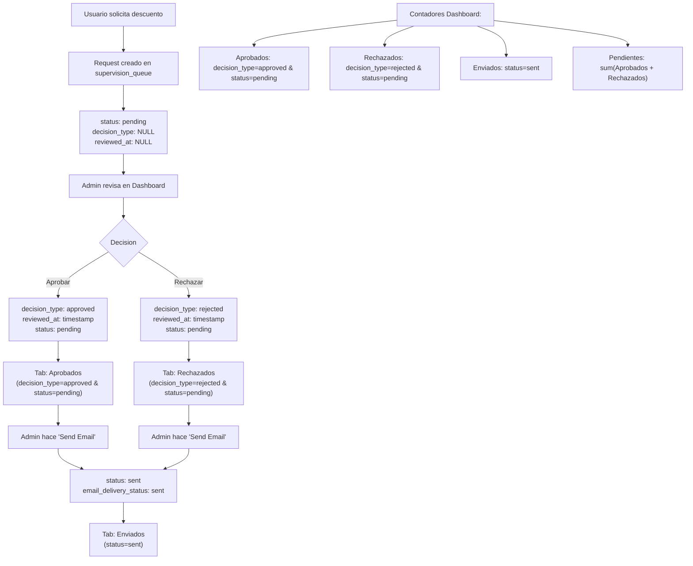

# IndieHOY Discount System 🎫

A simple and reliable system for requesting show discounts – deterministic, fast, and ready for production.

---

## Objective

A complete solution that allows users to request discounts for shows through:

-   A modern landing page with real-time show search
-   Email pre-validation to ensure only eligible users can request discounts
-   A human supervision dashboard for reviewing, editing, and approving requests
-   Ultra-fast, deterministic processing (less than 1 second per request)

**Current Status:** Fully functional and production-ready

Second Phase:
-    Community chatbot based on LLama though OLLama
-    RAG using LangChain
---

## System Overview

### User Flow

1.  **Show Search:**
    Users search for a show in real time and select from available options.

2.  **Email Validation:**
    The system validates the user's email, subscription status, and payment status before allowing a request.

3.  **Request Processing:**
    If valid, the request is processed using deterministic business rules and added to a human supervision queue.

4.  **Human Supervision:**
    Administrators review, approve, reject, or edit requests and emails via a dedicated dashboard.

---

## System Architecture



---

## Database Schemas

### USERS

| Field                | Type     | Description                 |
| -------------------- | -------- | --------------------------- |
| id                   | INT (PK) | Primary key                 |
| name                 | STRING   | Full name                   |
| email                | STRING   | Email address (unique)      |
| dni                  | INT      | DNI number (unique)         |
| phone                | STRING   | Phone number                |
| city                 | STRING   | User city                   |
| registration_date    | DATETIME | Registration date           |
| how_did_you_find_us  | STRING   | Discovery channel           |
| favorite_music_genre | STRING   | Music genre preference      |
| subscription_active  | BOOLEAN  | Active subscription status  |
| monthly_fee_current  | BOOLEAN  | Payment status (up to date) |
| created_at           | DATETIME | Record creation             |
| updated_at           | DATETIME | Record last update          |

### SHOWS

| Field         | Type     | Description                    |
| ------------- | -------- | ------------------------------ |
| id            | INT (PK) | Primary key                    |
| code          | STRING   | Internal show code (unique)    |
| title         | STRING   | Show title                     |
| artist        | STRING   | Artist/performer name          |
| venue         | STRING   | Venue location                 |
| img           | STRING   | Show image URL                 |
| show_date     | DATETIME | Show date and time             |
| max_discounts | INT      | Maximum discounts available    |
| ticketing_link| STRING   | Ticketing platform URL         |
| other_data    | JSON     | Additional data (city, price)  |
| active        | BOOLEAN  | Show active status             |
| created_at    | DATETIME | Record creation                |

### SUPERVISION_QUEUE

| Field                 | Type     | Description                         |
| --------------------- | -------- | ----------------------------------- |
| id                    | INT (PK) | Primary key                         |
| request_id            | STRING   | Unique request identifier           |
| user_email            | STRING   | User email                          |
| user_name             | STRING   | User name                           |
| show_description      | STRING   | Show description                    |
| decision_type         | STRING   | approved/rejected/needs_clarification |
| decision_source       | STRING   | prefilter_template/llm_generated    |
| show_id               | INT (FK) | Reference to shows.id               |
| email_subject         | STRING   | Email subject                       |
| email_content         | TEXT     | Email content                       |
| confidence_score      | FLOAT    | Decision confidence (0-1)           |
| reasoning             | TEXT     | Decision reasoning                  |
| processing_time       | FLOAT    | Processing time in seconds          |
| status                | STRING   | pending/sent                        |
| email_delivery_status | STRING   | sent/delivered/failed/bounced       |
| created_at            | DATETIME | Record creation                     |
| reviewed_at           | DATETIME | Human review timestamp              |
| reviewed_by           | STRING   | Reviewer identifier                 |
| supervisor_notes      | TEXT     | Supervisor notes                    |

### PAYMENT_HISTORY

| Field         | Type     | Description                  |
| ------------- | -------- | ---------------------------- |
| id            | INT (PK) | Primary key                  |
| user_id       | INT (FK) | Reference to users.id        |
| amount_paid   | FLOAT    | Payment amount               |
| payment_date  | DATETIME | Payment date                 |
| payment_method| STRING   | Payment method (card/transfer)|
| description   | STRING   | Payment description          |
| receipt       | STRING   | Receipt path/URL             |
| confirmed     | BOOLEAN  | Payment confirmation status  |
| created_at    | DATETIME | Record creation              |

### EMAIL_TEMPLATES

| Field         | Type     | Description                  |
| ------------- | -------- | ---------------------------- |
| id            | INT (PK) | Primary key                  |
| template_name | STRING   | Template identifier (unique) |
| subject       | STRING   | Email subject template       |
| body          | TEXT     | Email body template          |
| created_at    | DATETIME | Record creation              |
| updated_at    | DATETIME | Record last update           |

---

## API Endpoints

### Authentication
-   `POST /api/v1/auth/login` – Admin login
-   `POST /api/v1/auth/logout` – Admin logout
-   `GET /api/v1/auth/verify` – Verify session
-   `GET /api/v1/auth/sessions` – List active sessions

### Users
-   `POST /api/v1/users/check-email` – Check if email exists
-   `POST /api/v1/users/register` – Register new user
-   `POST /api/v1/users/validate-email` – Email pre-validation
-   `GET /api/v1/users/list` – List users (admin)
-   `PATCH /api/v1/users/{user_id}/payment-status` – Toggle payment status
-   `GET /api/v1/users/stats` – User statistics

### Shows
-   `GET /api/v1/shows/search?q={query}` – Real-time show search
-   `GET /api/v1/shows/available` – List available shows

### Discounts
-   `POST /api/v1/discounts/request` – Submit a discount request
-   `GET /api/v1/discounts/health` – Discount system health

### Supervision Queue
-   `GET /api/v1/supervision/queue?status={status}` – List requests by status
-   `POST /api/v1/supervision/queue/{id}/action` – Approve/Reject request
-   `POST /api/v1/supervision/queue/{id}/send` – Mark as sent
-   `GET /api/v1/supervision/stats` – Queue statistics
-   `GET /api/v1/supervision/queue/{id}` – Get specific request
-   `PUT /api/v1/supervision/queue/{id}/edit` – Edit request content

### Chat (LLM Integration)
-   `POST /api/v1/chat/message` – Send chat message
-   `GET /api/v1/chat/history/{user_id}` – Get chat history
-   `DELETE /api/v1/chat/history/{user_id}` – Clear chat history

### System Health
-   `GET /health` – System health check
-   `GET /health/ollama` – OLLama service health
-   `GET /health/database` – Database connectivity
-   `GET /docs` – API documentation

---

## Tech Stack

-   **Backend:** Python 3.11, FastAPI, SQLAlchemy, SQLite/PostgreSQL, Pydantic, FuzzyWuzzy
-   **Frontend:** HTML5, JavaScript ES6, Tailwind CSS, Fetch API
-   **DevOps:** Docker, Git, GitHub

---

## Setup

```bash
git clone <repo-url>
cd backend
docker build -t charro-backend .
docker run -d -p 8000:8000 --name charro-backend charro-backend
```

-   Landing Page: http://localhost:8000/request
-   Admin Dashboard: http://localhost:8000/supervision
-   API Docs: http://localhost:8000/docs
-   Health Check: http://localhost:8000/health

---

## Roadmap

-   **Phase 1 (Current):** Deterministic, rule-based discount system with human supervision and modern frontend.
-   **Phase 2 (Planned):** Integration of a community chatbot as a microservice for conversational discount requests.
