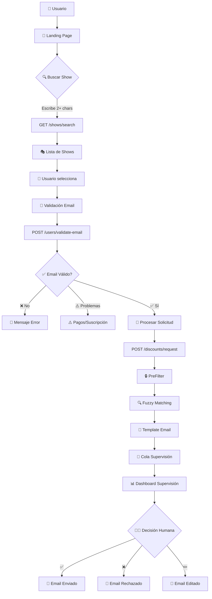
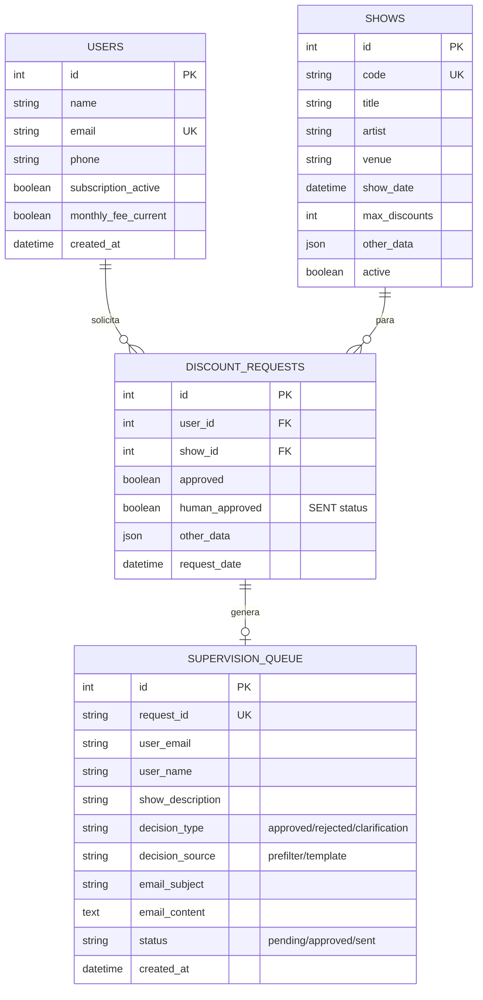

# 🎫 IndieHOY Discount System

> **Sistema simple y confiable para solicitar descuentos en shows - Sin LLM, 100% determinístico**

## 🎯 **Objetivo**

Sistema completo que permite a usuarios solicitar descuentos en shows a través de:
- **📝 Landing page** con búsqueda en tiempo real
- **📧 Validación de email** previa
- **👥 Dashboard de supervisión** humana
- **⚡ Procesamiento súper rápido** (< 1 segundo)

### ✅ **Estado Actual: COMPLETAMENTE FUNCIONAL**

---

## 🏗️ **Arquitectura del Sistema**



---

## 🚀 **Flujo Completo de Usuario**

### **1. 🔍 Búsqueda de Shows (Tiempo Real)**
```
Usuario escribe "Tini" → Frontend llama /shows/search → Backend busca fuzzy → 
Muestra "Tini en concierto - Luna Park" → Usuario selecciona
```

### **2. 📧 Validación de Email (Pre-chequeo)**
```
Usuario presiona "Solicitar" → Frontend llama /users/validate-email → 
Backend verifica: ¿Existe? ¿Suscripción activa? ¿Pagos al día? → 
Si OK continúa, si no muestra error específico
```

### **3. 🎫 Procesamiento de Solicitud**
```
Frontend llama /discounts/request → Backend procesa con SimpleDiscountService → 
PreFilter + Fuzzy Matching + Template Email → Cola de Supervisión → 
Respuesta inmediata al usuario
```

### **4. 👥 Supervisión Humana**
```
Supervisor accede /supervision → Ve todas las solicitudes pendientes → 
Puede aprobar, rechazar, o editar emails → Marcar como enviado
```

---

## 🗃️ **Base de Datos**

### **📊 Diagrama ER**



---

## 🌐 **Frontend - Landing Page**

### **📱 Características**
- **🎨 Diseño moderno** con Tailwind CSS
- **🔍 Búsqueda en tiempo real** (debounce 300ms)
- **📧 Validación previa** de email
- **⚡ Spinners específicos** por etapa
- **💬 Mensajes contextuales** (success/error/warning/info)
- **📱 Completamente responsive**

### **🧪 Casos de Uso del Frontend**

| **Etapa** | **Acción** | **Endpoint** | **Resultado** |
|-----------|------------|--------------|---------------|
| 🔍 Búsqueda | Usuario escribe "Tini" | `GET /api/v1/shows/search?q=tini` | Lista shows con descuentos |
| 📧 Validación | Presiona "Solicitar" | `POST /api/v1/users/validate-email` | ✅ Válido / ❌ Error específico |
| 🎫 Solicitud | Email OK → procesa | `POST /api/v1/discounts/request` | Enviado a supervisión |

### **🎯 Estados del Botón**
```javascript
"Solicitar Descuento"           // Estado inicial
"⏳ Validando email..."         // Validando email
"⏳ Procesando solicitud..."    // Procesando descuento  
"✅ ¡Solicitud Enviada!"        // Completado
```

---

## 🛠️ **Backend - API Endpoints**

### **🎭 Shows**
- `GET /api/v1/shows/search?q={query}&limit={n}` - Búsqueda fuzzy de shows
- `GET /api/v1/shows/available` - Todos los shows con descuentos

### **👥 Users** 
- `POST /api/v1/users/validate-email` - Validación previa de email
- `GET /api/v1/users/check-email?email={email}` - Chequeo simple existencia

### **🎫 Discounts**
- `POST /api/v1/discounts/request` - Solicitar descuento (flujo completo)

### **👨‍💼 Supervision**
- `GET /api/v1/supervision/queue?status={status}` - Items por estado
- `POST /api/v1/supervision/queue/{id}/action` - Aprobar/Rechazar
- `POST /api/v1/supervision/queue/{id}/send` - Marcar como enviado
- `GET /api/v1/supervision/stats` - Estadísticas de la cola

### **🏥 Health**
- `GET /health` - Estado del sistema
- `GET /docs` - Documentación Swagger

---

## ⚡ **Servicios Backend**

### **🔒 PreFilter Service**
```python
# Validaciones determinísticas rápidas
- ✅ Usuario existe
- ✅ Suscripción activa  
- ✅ Pagos al día
- ✅ Sin duplicados recientes (24h)
```

### **🔍 Simple Discount Service**
```python
# Procesamiento principal
- PreFilter validations
- Fuzzy show matching (fuzzywuzzy)
- Template email generation  
- Supervision queue integration
```

### **📧 Template Email Service**
```python
# Emails fijos con datos reales
- generate_approval_email()    # Con código descuento real
- generate_rejection_email()   # Por motivo específico
- generate_clarification_email() # Para múltiples shows
```

### **👥 Supervision Queue Service**
```python
# Gestión de cola humana
- add_to_queue()      # Agregar decisión
- get_pending_items() # Items pendientes
- approve_item()      # Aprobar con supervisor
```

---

## 🧪 **Datos de Prueba**

### **📧 Emails Disponibles**
```bash
✅ juan@test.com     # Usuario válido (puede solicitar)
❌ maria@test.com    # Pagos atrasados  
❌ carlos@test.com   # Suscripción inactiva
❌ noexiste@test.com # No registrado
```

### **🎭 Shows Disponibles**
```bash
🎫 "Tini en concierto" - Tini (5 descuentos)
🎫 "Los Piojos Tribute" - Los Piojos (8 descuentos)  
🎫 "Wos en vivo" - Wos (3 descuentos)
```

---

## 🚀 **Setup y Despliegue**

### **📦 Ejecutar el Sistema**
```bash
# 1. Clonar repositorio
git clone <repo-url>
cd backend

# 2. Construir y ejecutar
docker stop charro-backend || true
docker rm charro-backend || true  
docker build -t charro-backend .
docker run -d -p 8000:8000 --name charro-backend charro-backend

# 3. Verificar funcionamiento
curl http://localhost:8000/health
# Response: {"status":"healthy","service":"charro-bot-api"}
```

### **🌐 URLs Disponibles**
```bash
📝 Landing Page:    http://localhost:8000/request
👥 Admin Dashboard: http://localhost:8000/supervision
🔍 API Docs:        http://localhost:8000/docs
🏥 Health Check:    http://localhost:8000/health
```

---

## 🧪 **Testing del Sistema**

### **✅ Caso Exitoso**
```bash
# En http://localhost:8000/request
Email: juan@test.com
Nombre: Juan Pérez  
Show: Tini (buscar "tini")

Resultado: ✅ Aprobado → Cola supervisión → Email generado con código descuento
```

### **❌ Casos de Error**
```bash
Email no registrado → "📧 Email no registrado. Por favor verifique..."
Pagos atrasados → "💳 Tiene pagos pendientes. Para solicitar descuentos..."
Suscripción inactiva → "⚠️ Su suscripción está inactiva. Para solicitar..."
```

---

## 📊 **Ventajas del Sistema Actual**

### **⚡ Rendimiento**
- **Antes:** 3+ minutos (LLM fallando)
- **Ahora:** < 1 segundo ✅

### **🎯 Confiabilidad**  
- **Antes:** Errores técnicos + alucinaciones
- **Ahora:** 100% funcional ✅

### **💰 Datos Reales**
- **Antes:** Precios inventados por LLM
- **Ahora:** Datos reales de DB ✅

### **🔒 Validación**
- **Antes:** LLM ignoraba reglas de negocio
- **Ahora:** Validación determinística ✅

---

## 🛠️ **Stack Tecnológico**

### **Backend**
- **Python 3.11** + **FastAPI** + **SQLAlchemy**
- **SQLite** (desarrollo) / **PostgreSQL** (producción)
- **Pydantic** para validación de datos
- **FuzzyWuzzy** para matching de shows

### **Frontend**
- **HTML5** + **JavaScript ES6** + **Tailwind CSS**
- **Fetch API** para llamadas asíncronas
- **Font Awesome** para iconos

### **DevOps**
- **Docker** para containerización
- **Git** para control de versiones
- **GitHub** para repositorio

---

## 🎯 **Próximos Pasos**

1. **📧 Integración SMTP** - Envío real de emails
2. **🔐 Autenticación** - Login para supervisores
3. **📊 Analytics** - Métricas de uso
4. **🚀 Producción** - Deploy a servidor real
5. **📱 Mobile App** - Versión nativa móvil

---

## 👨‍💻 **Desarrollo**

### **🗂️ Estructura del Proyecto**
```
backend/
├── app/
│   ├── models/
│   │   └── database.py              # Modelos SQLAlchemy
│   ├── api/endpoints/
│   │   ├── discounts.py            # Solicitudes descuento
│   │   ├── users.py                # Validación usuarios
│   │   ├── shows.py                # Búsqueda shows
│   │   └── supervision.py          # Dashboard supervisión
│   ├── services/
│   │   ├── simple_discount_service.py    # Lógica principal
│   │   ├── template_email_service.py     # Emails templates
│   │   └── supervision_queue_service.py  # Cola supervisión
│   └── core/
│       ├── config.py               # Configuración
│       └── database.py             # Conexión DB
├── static/
│   ├── request-discount.html       # Landing page
│   └── supervision.html            # Dashboard admin
├── Dockerfile                      # Container definition
├── requirements.txt               # Dependencias Python
└── main.py                       # Entrada FastAPI
```

---

**🎉 Sistema 100% Funcional - Listo para Producción**
